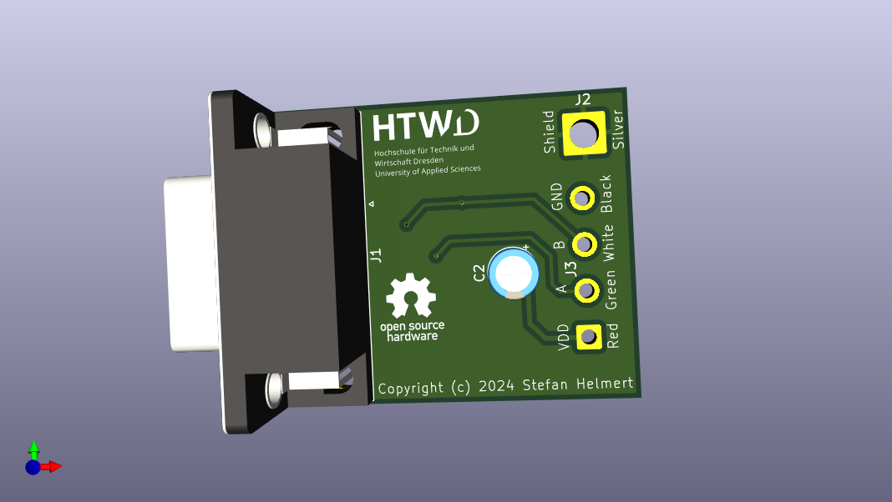

# Rotary Encoder Protection Board

The rotary encoders don't have any electrical protection mechanism. Overcurrent into the open collector outputs will damage them.

This board protects the rotary encoder against reverse polarity and short overvoltage spikes on the power supply line. Each data line is protected using a 10k resistor in series. Pull-up resistors are incooperated on the encoder side. That means, the board outputs are directly high impedance logic level. External voltage to these data pins won't damage the encoder or protection board.

Direct connection to ICs with a low voltage tolerance at the inputs is possible, because the clamp diodes in the IC will limit the voltage from the high impedance outputs of the board. 

## Associated Projects

That protection board is part of the plug at the rotary encoder cable. It is intended to be connected to the logic board, which implements the data processing:

* https://github.com/TheTesla/OSH-CMM-LogicBoard

## Author/Contact

Stefan Helmert <stefan.helmert@htw-dresden.de>

